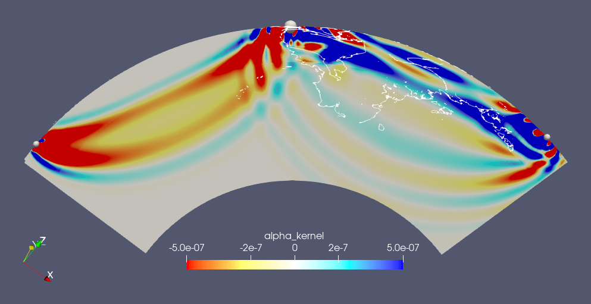

<a href="https://seisscoped.org/"></a>

# The jupyter notebook and data for the 2024 SCOPED workshop



This repository contains the jupyter notebook and data for the 2024 SCOPED workshop. Below is a brief description of the files in this repository:

- `data_processing_and_run_fwi_demo.ipynb`: A jupyter notebook that demonstrates how to process the data and run the FWI demo.
- `data`: the data for the FWI demo, which will be downloaded after running the notebook.
- `quakeml`: the QuakeML files for the FWI, which will be created after running the notebook.
- `simulation`: a directory where we run forward/adjoint simulations with Specfem3D_globe. The essential files will be created here after running the notebook.
- `_data_backup`: backup of the observed and synthetic seismograms, and QuakeML files used in the notebook.
- `img`: images used in the notebook and README.md.

# How to run the notebook

- Create a symbolic link to SCRATCH directory:
```bash
ln -s $SCRATCH scratch
```
- Clone this repository:
```bash
cd scratch
git clone https://github.com/mnagaso/workshop_scoped_2024.git
```
- Submit the job:
```bash
cd workshop_scoped_2024
sbatch job.jupyter
```
- Check the job status:
```bash
squeue -u $USER
```
- After starting the job, you will see the url to access the jupyter lab interface. Copy the url and paste it into your browser (or Ctrl+Click on the url).
This link is something like:
```
tail jupyter.out

TACC: created reverse ports on Frontera logins
TACC: Your jupyter notebook server is now running at https://frontera.tacc.utexas.edu:60188/?token=ee7153b2ec3569dabea24b66de63247efed8cf2e8f203036cc2f490c58321fc7
```

